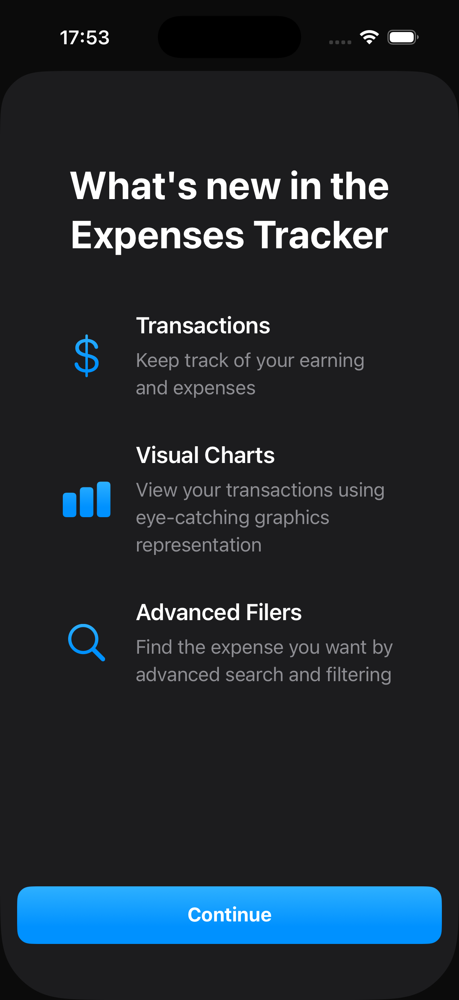
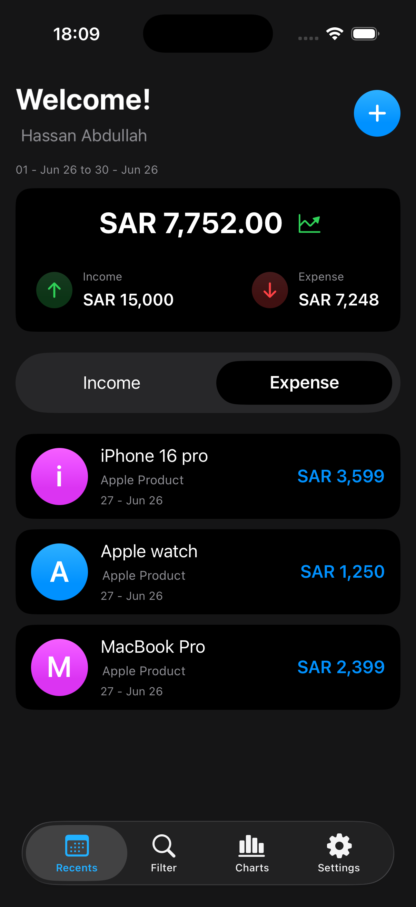
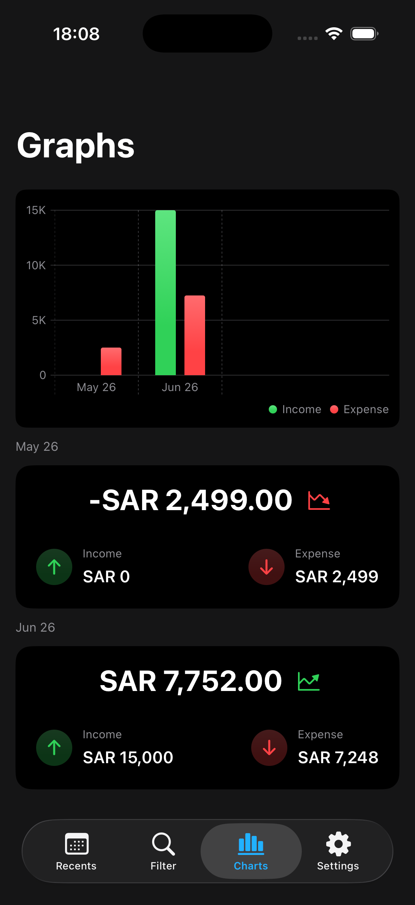
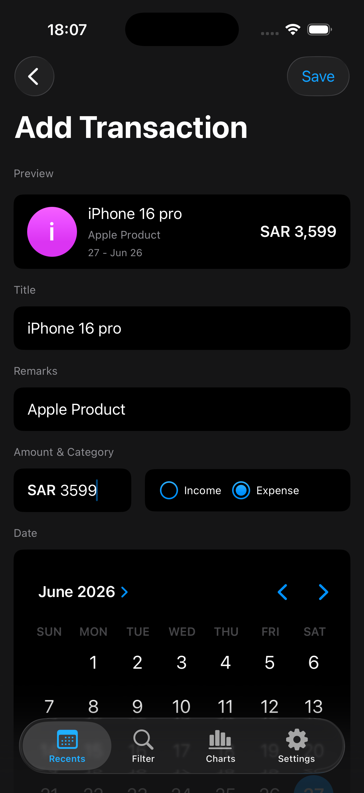
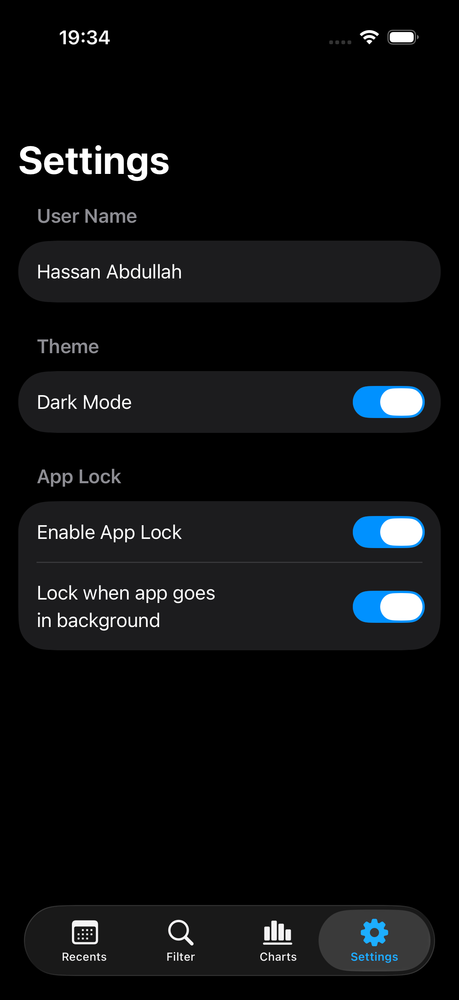
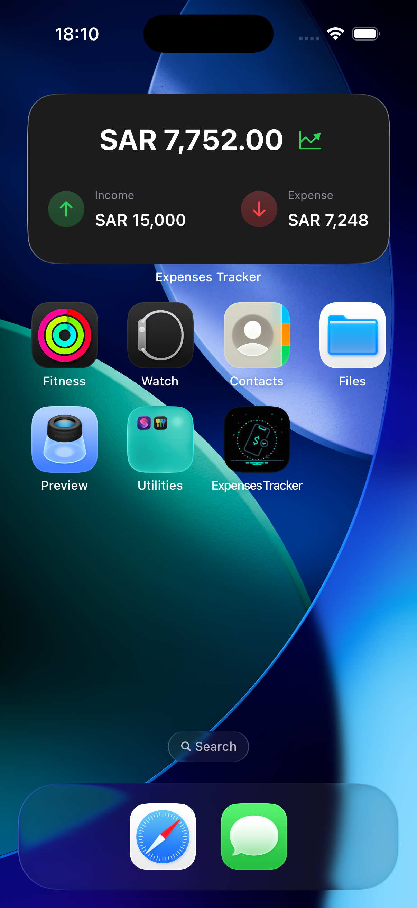

# 📊 Expense Tracker App

A modern, native iOS application built using **SwiftUI** and **SwiftData** to help users track transactions, visualize monthly expenses with Swift Charts, and secure their financial data.

---

## 📱 Features

* **Dynamic Data Visualization:** Real-time generation of multi-category bar charts using `Swift Charts` grouped by month.
* **Local Persistence:** Powered by `SwiftData` for seamless, fast data syncing and robust `@Query` sorting.
* **Custom Appearance:** Includes an in-app theme toggle allowing users to override system dark/light modes.
* **Privacy Controls:** Biometric/App-Lock mechanism supporting background state state persistence.

---

---

## 📸 App Interface

### 🟢 First Impression & Core View
| First Launch (Empty State) | Home Screen |
| :---: | :---: |
|  |  |

### 📊 Data & Transactions
| Analytics & Graphs | Add New Transaction |
| :---: | :---: |
|  |  |

### ⚙️ Adjustments & Extensions
| Application Settings | Home Screen Widget |
| :---: | :---: |
|  |  |

---

---
